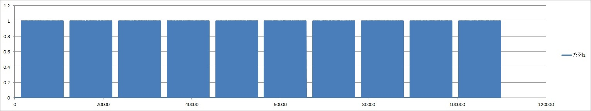
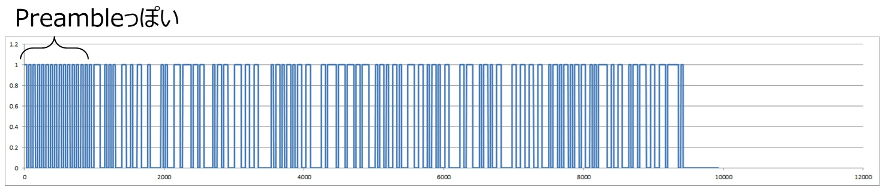

# ask [com]
## 問題文

+ Amplitude Shift Keying

## FLAG

```
FLAG{als0-k0own-4s-0n-0ff-key1ng}
```

## 解法

### はじめに

ワイヤレスネットワーク問題2問目です。
ちょっとエスパー入ってしまいましたかね．．．
ASKという変調方式は、信号の振幅にデータを載せる方式です。
もう少し分かりやすく言うと、ONとOFFにデータを載せます。
とても基本的な変調方式なので、かなりいろんな怪しい無線デバイスで使われています。

この手の通信の物理層の解析をするときは、まずはcsvをグラフ化してみます。
すると繰り返しパケットっぽいものが見えるので、このパケットの1つ分だけcsvから切り出してpacket.csvとします。

そしてこんどはそのpacket.csvをさらにグラフ化してみます。
すると添付のような信号が得られます。
この1とゼロの繰り返しのところにデータが載っているんだろうな、とあたりを付けます。
ヒントとして出しておいた方が良かったなーと思ったのがこのパケットにはプリアンブルとスタートコードがついている点です。
プリアンブルは、多くの場合1と0の繰り返しでシンボルタイミング同期や周波数同期をするのに使われます。
今回の例では、1と0が時間にしてどのくらい続いているものを1bitとして扱うかに相当します。
スタートコードは、プリアンブルとデータの間に位置していて、ここからデータが始まるよ、という印になっています。
また、プリアンブルのところを見るとどうやら1ビットの長さは31シンボル分だな、ということが分かります。



上記の情報を基に31個続いている1や0を1つの0に変換して、あとはbinaryと同じように8個のbitをcharに変換しながら出力するだけです。
ビットずれを起こすのはワイヤレスネットワークの解析でよくあるので、なんかずれてるなと思ったら1bitずらして再デコード、みたいなことをやってると解けます。



```
fp = open("./packet.csv", "r")

vals = fp.readlines()

count = 1
pre_val = 0
current = 0

val_bins = []

for i in range(len(vals)):
    pre_val = current
    current = int(vals[i])
    if current == pre_val:
        count = count + 1
    else:
        count = 1

    if count == 31:
        print(pre_val)
        val_bins.append(pre_val)
        count = 1

c = 0
for i in range(len(val_bins)):
    val = int(val_bins[i])
    c = (c << 1) | val
    if i % 8 == 7:
        print(chr(c), end="")
        c = 0

print("")
```

