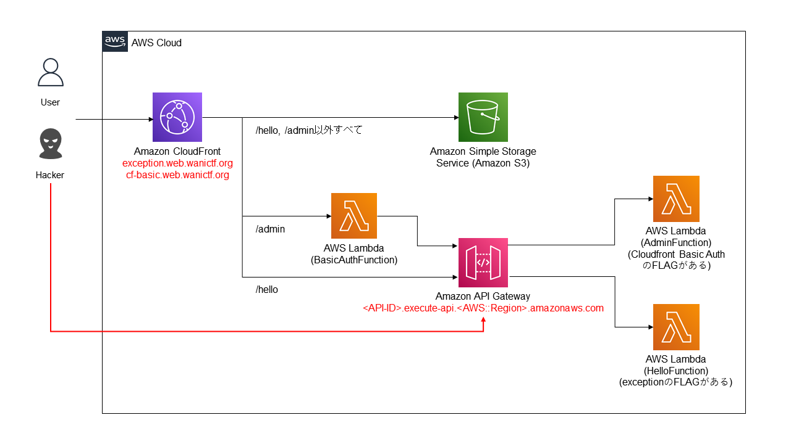

# CloudFront Basic Auth

## 問題文
API Gateway, Lambda, S3, CloudFront, CloudFormationを使ってアプリを作ってみました。

重要なエンドポイントにはBasic認証をつけてみました。

<https://cf-basic.web.wanictf.org/>

ヒント: 上のURLにアクセスすると`exception`と同じ見た目のWebアプリが表示されますが、添付されているzipファイルには`exception`の添付ファイルから新しいファイルが追加されています。添付ファイルを参考にもう一つのFLAGを発見してください！

## フラグ

`FLAG{ap1_g4teway_acc3ss_con7rol}`

## 解法
* `template.yml`を確認すると、一番上に`Serverless Application Model(SAM)を用いて作成したAWS Cloudformation template`みたいなことが書かれているが、ざっくりいうと`template.yml`は今回のWebアプリのAWSのシステム構成を表すもの
* 図にしてみると以下のようになる
  * 矢印はリクエストの流れ
  * 厳密じゃないところや省いているところがあります



* Webアプリの上部に`Admin`というリンクがあるが、押すとBasic認証画面が表示される。これは`BasicAuthFunction`がCloudFrontの`/admin`に設定されているため
* しかし、`template.yml`をよく見ると、API Gatewayには特に認証が設定されていないように見える。つまり、`<API-ID>.execute-api.<AWS::Region>.amazonaws.com`の`<API-ID>`と`<AWS::Region>`を知ることができれば、API Gatewayに直接アクセスすることができ、BasicAuthFunctionを無視することができる
  * 図でいうと`Hacker`のルートでアクセスするということ
* `exception`でFLAGを取得した際に、`flag`のほかにも様々な情報が帰ってきていたことを思い出し、見返してみる
  * 重要ではないところは省略してあります
```json
// /helloに対して例外が発生するJSONを送信した場合のレスポンス
{
    "error_message": [
        "TypeError: can only concatenate str (not \"int\") to str\n"
    ],
    "event": {
        "body": "{\"name\": 1}",
        "headers": {
            ...
        },
        "httpMethod": "POST",
        "isBase64Encoded": false,
        "multiValueHeaders": {
            ...
        },
        "multiValueQueryStringParameters": null,
        "path": "/hello",
        "pathParameters": null,
        "queryStringParameters": null,
        "requestContext": {
            "apiId": "boakqtdih8",
            "domainName": "boakqtdih8.execute-api.us-east-1.amazonaws.com",
            "domainPrefix": "boakqtdih8",
            "extendedRequestId": "esJC1FCCoAMFzDw=",
            "httpMethod": "POST",
            "identity": {
                ...
            },
            "path": "/Prod/hello",
            "protocol": "HTTP/1.1",
            "requestId": "59b58e82-ed1b-4dd2-b1c1-2ca78c3df9db",
            "requestTime": "02/May/2021:07:31:17 +0000",
            "requestTimeEpoch": 1619940677277,
            "resourcePath": "/hello",
            "stage": "Prod"
        },
        "resource": "/hello",
        "stageVariables": null
    },
    "flag": "FLAG{b4d_excep7ion_handl1ng}" // これはexceptionのFLAG
}
```
* `/hello`はexceptionのFLAG以外にもAPI Gatewayのdomainを返してしまっている
  * `hello.py`を見ると例外発生時に`event`という第一引数も一緒にreturnしている
  * AWSの仕様で、API Gatewayがlambdaを(プロキシ結合という設定方法で)呼び出せるようにした場合、`event`にAPI Gatewayの情報として`API-ID`やAPI Gatewayのドメイン名を含むようになっている
```python
# hello.py
def lambda_handler(event, context):
    try:
        try:
            data = json.loads(event["body"])
        except Exception:
            data = {}
        if "name" in data:
            return {
                "statusCode": 200,
                "body": json.dumps({"name": "こんにちは、" + data["name"] + "さん"}),
            }
        return {
            "statusCode": 400,
            "body": json.dumps(
                {
                    "error_message": "Bad Request",
                }
            ),
        }
    except Exception as e:
        error_message = traceback.format_exception_only(type(e), e)
        del event["requestContext"]["accountId"]
        del event["requestContext"]["resourceId"]
        return {
            "statusCode": 500,
            "body": json.dumps(
                {
                    "error_message": error_message,
                    "event": event,
                    "flag": os.environ.get("FLAG"),
                }
            ),
        }
```
* `https://${event.requestContext.domainName}/${event.requestContext.stage}/admin`にアクセスしてAPI Gatewayの`/admin`に直接アクセスするとFLAGが返ってくる
  * API Gatewayには`Stage`という機能があるため、`https://${event.requestContext.domainName}/admin`にアクセスしても何も返ってこないので注意
