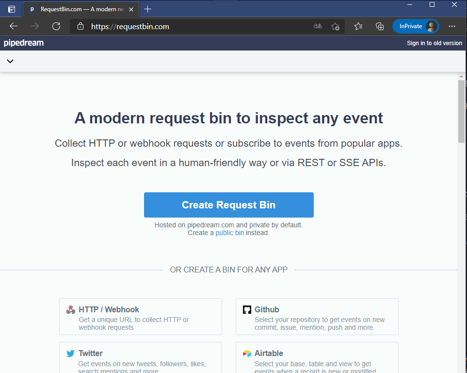
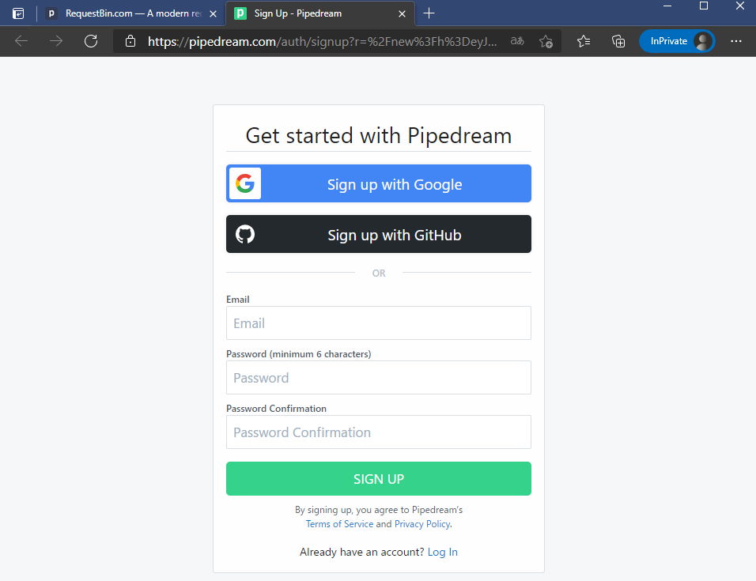
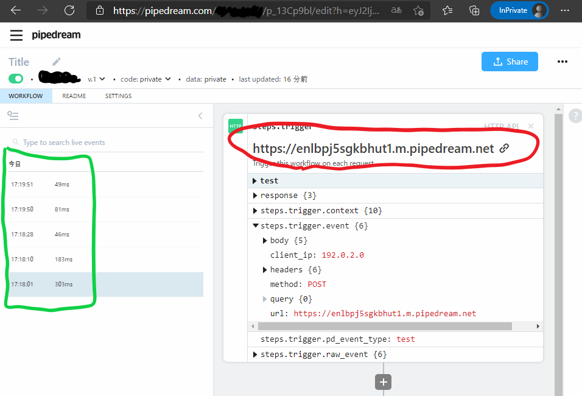
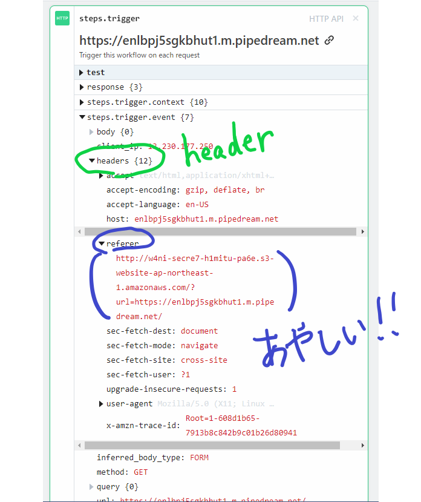
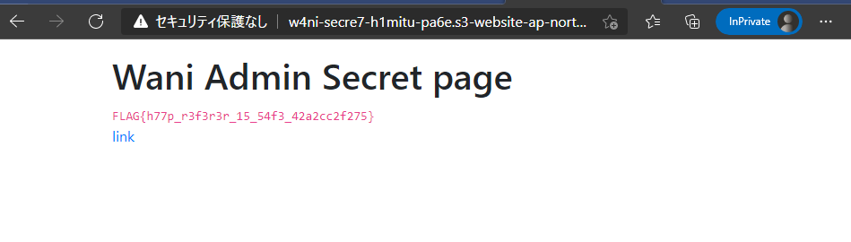

# wani_request

## 問題文

RequestBinを使ってみよう!!

<https://request1.web.wanictf.org/>

この問題ではあどみんちゃんから自分のサーバにアクセスしてもらう必要があります。

自前でサーバを用意するのが難しい方はRequestBinなどのサービスを利用してみましょう。

サーバが用意出来たらいよいよ本番です。

問題ページにアクセスし、あなたが用意したサーバのURLを送信してください。

送信するとあどみんちゃんの秘密のページにあなたの送信したURLのリンクが表示されます。

あどみんちゃんは表示されたリンクをクリックしてあなたのサーバにアクセスしてくれます。

あどみんちゃんからのアクセスを分析して秘密のページを探してみてください。

HINT1 : [HTTP ヘッダー](https://developer.mozilla.org/ja/docs/Web/HTTP/Headers)
HINT2 : xss問題ではありません。

## フラグ

`FLAG{h77p_r3f3r3r_15_54f3_42a2cc2f275}`

## 解法

### はじめに
この問題は Wani Request 2 でXSS問題を解くための準備問題として作りました。

私がCTFを始めたての頃、XSSって何だ！と混乱している時に「自前のサーバで情報を受けとる」というのは割とハードルが高かった覚えがあります。
そこで脆弱性云々は脇に置いて、まずはシンプルにサーバに届いた情報を見るだけの問題を解いてもらい、ハードルを一つ減らした上で2問目のXSS問題に取り組んでもらおうと考えました。

### サーバの用意(RequestBinの紹介)
この問題では手軽にサーバを用意する手段としてRequestBinを紹介しています。
問題を解く前に利用法について簡単に説明しておきます。 

まずは[こちらのページ](https://requestbin.com/)にアクセスし、「Create Request Bin」というボタンを押します。



アカウント登録を促されますので、適当に作成してください。



登録が出来たら↓のような管理ページにアクセスできます。

赤色で囲ってある文字列は、あなたのサーバのURLです。

緑色で囲ってあるのは、あなたのサーバに対するアクセスの履歴です。

試しに自分のブラウザのからサーバのURLにアクセスすると履歴が追加されるのが確認できると思います。



### 想定解法

サーバの準備が出来たので、問題を解いていきます。問題文を確認すると、

```
問題ページにアクセスし、あなたが用意したサーバのURLを送信してください。

送信するとあどみんちゃんの秘密のページにあなたの送信したURLのリンクが表示されます。

あどみんちゃんは表示されたリンクをクリックしてあなたのサーバにアクセスしてくれます。

あどみんちゃんからのアクセスを分析して秘密のページを探してみてください。
```

と書いてあります。

あどみんちゃんのアクセスを貰うためには、用意したサーバのURLを問題ページから送信すれば良さそうなので早速送信してみましょう。


送信したらサーバの管理ページに戻って内容を確認します。

内容を確認すると言っても何か当たりをつけてチェックしたいところですが、ヒントを見てみるとHTTPヘッダーが紹介されています。HTTPヘッダーに何か情報がありそうです。



受けっとった情報からヘッダーの部分を見ていると、refererの項目に```http://w4ni-secre7-h1mitu-pa6e.s3-website-ap-northeast-1.amazonaws.com/?url=https://enlbpj5sgkbhut1.m.pipedream.net/```というURLが見つかります。

wani-secret-himitu-pageなんて如何にも怪しいので、こちらのページにアクセスしてみましょう。



やはりここがあどみんちゃんの秘密のページだったようです。

無事にフラッグをゲットできました。

### おわりに

今回の問題で利用した[Referer](https://developer.mozilla.org/ja/docs/Web/HTTP/Headers/Referer)とは「現在リクエストされているページへのリンク先を持った直前のウェブページのアドレス」を含むヘッダーのことです。

サーバの管理者側からすると、誰かが自分のサーバへのリンクを踏んでアクセスしたきたら、そのリンクの貼ってあったページのアドレスが分かる、ということです。

今回の問題の場合、プレイヤーが送信してきたURLのリンクが秘密のページに表示されます。あどみんちゃんはそのリンクを踏んでプレイヤーのサーバにアクセスしてくれるので、refererに秘密のページの情報が残っていた、ということです。

refererの設定によってはURLパラメータもヘッダーに含まれる場合があるので、(あまり無いとは思いますが)URLパラメータにパスワードなどの認証情報が含まれている場合などは注意が必要です。

refererの制御は[Referrer-Policy](https://developer.mozilla.org/ja/docs/Web/HTTP/Headers/Referrer-Policy)によって行われるので、気になる人は[Referer ヘッダーのプライバシーとセキュリティの考慮事項](https://developer.mozilla.org/ja/docs/Web/Security/Referer_header:_privacy_and_security_concerns)と合わせて読んでみてください。